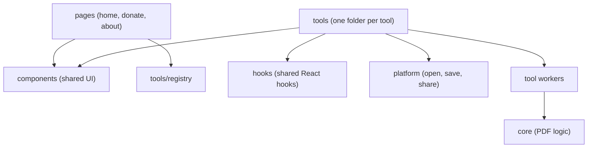
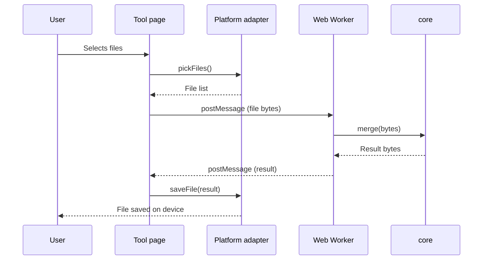
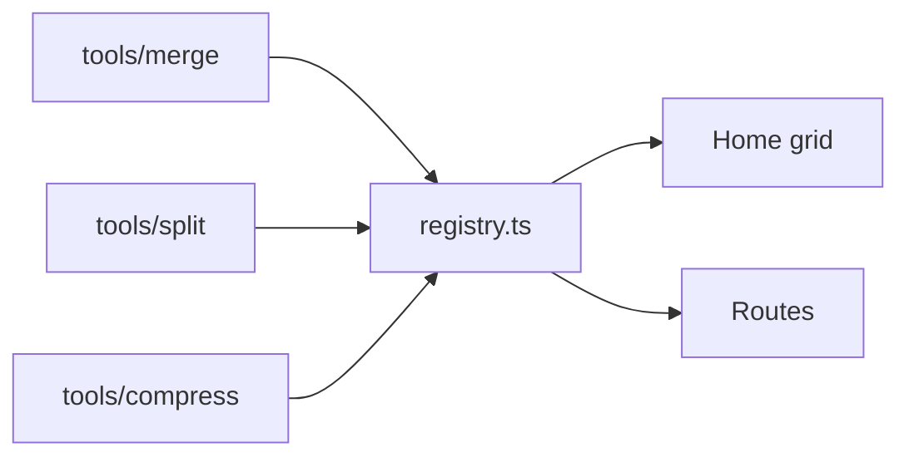

# Architecture

This page explains how we plan to arrange the code. It is a plan to keep things simple as the project grows, not a strict law. If you feel something should change, please open an issue and tell us.

InTab PDF runs fully on the user's device. There is no server, no database and no login. All the PDF work happens in the browser, or inside the Tauri and Capacitor apps later.

## What we want from this code

Every rule on this page comes from four goals.

| Goal | What it means for us |
|---|---|
| Simple | Choose the plain way. No clever tricks and no extra layers. A new student should understand a file in a few minutes. |
| Modular | One tool lives in one folder. Tools do not depend on each other. Shared things go to `core`, `components` or `hooks`. |
| Explainable | You can say what a file does, and why it is there, in one or two sentences. Names are clear and comments explain the why. |
| Maintainable | PRs are small, `core` has tests, and docs are updated along with the code. Anyone in the group can take over any part. |

The project is at a very early stage, so please do not build for the future. Build only what is needed now, and keep it simple. When a real need comes, we will improve it together.

## The big picture



The arrows show who can use whom. Code flows in **one direction only**. `core` sits at the bottom and knows nothing about the rest of the app. `pages` are the non-tool screens: they may use `components` and read the tool list, but they never contain PDF logic.

## How one job flows

This is what happens when a user merges two PDFs.



The page never does PDF work itself. The worker does it, and the worker only calls `core`.

## The simple rules

These few rules keep the project easy to work on when many people join. Each one has a reason, so they are easy to remember.

1. **`core` imports nothing from the rest of the app.** This way we can test it easily and reuse it anywhere.
2. **`core` has no platform checks and no file paths.** Bytes in, bytes out.
3. **Platform-specific code lives only in `platform/`** and the native shells.
4. **PDF logic never lives inside a React component.**
5. **One tool does not import another tool.** If two tools need the same code, move it to `core`, `components` or `hooks`.
6. **Use `HashRouter`,** so the app works on static hosting, Tauri and Capacitor without server settings.
7. **No native PDF code in Rust or Kotlin.** One TypeScript version keeps all platforms the same.

Later, when the project is bigger, we may add ESLint rules so that mistakes with rules 1, 2 and 5 are caught automatically. See [Code quality](code-quality.md).

## Web Workers

Heavy work runs in a Web Worker, so the screen does not freeze on big PDFs or slow phones.

- The worker file (`<tool>.worker.ts`) lives **inside its tool folder** (`src/tools/<name>/`). There is no global `src/workers/` folder. It is a thin wrapper: it receives a message, calls the `core` function and sends back the result.
- The shared message types live in `src/tools/types.ts`, and the shared `useWorker` hook lives in `src/hooks/`.
- Send `ArrayBuffer`s as **transferable** objects. This avoids copying big files in memory.
- Try to use the same message shape in every tool, so shared hooks can work with any worker.

```ts
// An idea for the message shape. We will change it when the first tool is built.
type WorkerRequest<T> = { id: string; payload: T };

type WorkerResponse<R> =
  | { id: string; ok: true; result: R }
  | { id: string; ok: false; error: string };

// For long jobs you can also send: { id: string; progress: number }
```

## Platform adapter

`platform/` hides the difference between browser, Tauri and Capacitor. Tools only talk to this interface and never check which platform they are on.

```ts
// src/platform/types.ts (an idea, not final)
export interface PlatformAdapter {
  pickFiles(opts: { accept: string[]; multiple: boolean }): Promise<File[]>;
  saveFile(bytes: Uint8Array, suggestedName: string): Promise<void>;
  share?(bytes: Uint8Array, name: string): Promise<void>;
}
```

`platform/index.ts` finds out where the app is running and gives the right version.

## Tool registry

`tools/registry.ts` is the one list of tools. The home grid (`pages/HomePage.tsx`) and the routes in `App.tsx` are both made from it, so adding a new tool never needs a change in the router or the home page.



## Words used in these docs

| Word | Simple meaning |
|---|---|
| Web Worker | A background thread in the browser. Heavy work runs here so the screen does not hang. |
| Bundle | The final JavaScript files that Vite builds for the app. |
| Lazy loading | Loading a page or library only when the user opens it. We use dynamic `import()` for this. |
| Adapter | A small layer that gives the same functions on different platforms. `platform/` is our adapter. |
| Registry | One list of all tools. The home screen and the routes are made from it. |
| Transferable | Moving a buffer to a worker without copying it. This saves memory. |
| CSP | Content-Security-Policy. A browser rule that blocks network requests we did not allow. |

## See also

- [Folder guide](folder-guide.md) for what goes in each folder
- [Adding a tool](adding-a-tool.md) to build a new tool
- [Decisions log](decisions.md) for the reasons behind these rules
