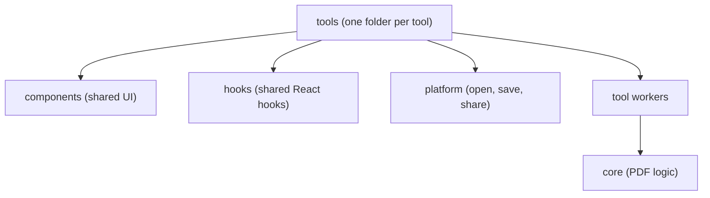
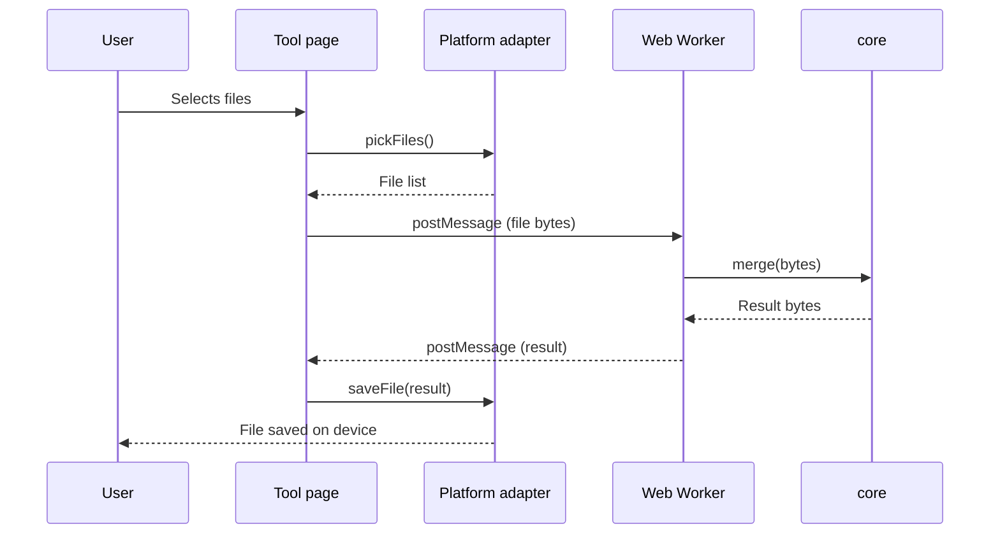
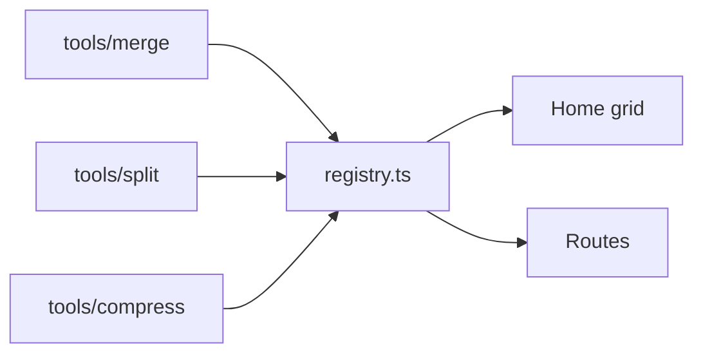

# Architecture

InTab PDF runs fully on the user's device. There is no server, no database and no login. All PDF work happens in the browser (or inside the Tauri and Capacitor shells).

## The big picture



Arrows show who is allowed to import whom. Dependencies go in **one direction only**. `core` is at the bottom and imports nothing from the app.

## How one operation flows

This is what happens when a user merges two PDFs.



Notice that the page never does PDF work itself. The worker does it, and the worker only calls `core`.

## The rules

These rules keep the project modular. Reviewers will check them.

1. `core` imports nothing from the rest of the app.
2. `core` has no platform checks and no file paths. Bytes in, bytes out.
3. Platform-specific code lives only in `platform/` and the native shells.
4. PDF logic never lives inside a React component.
5. One tool never imports another tool. If two tools need the same code, move it to `core`, `components` or `hooks`.
6. Routing uses `HashRouter`, so the app works on static hosting, Tauri and Capacitor without any server settings.
7. No native PDF code in Rust or Kotlin. One TypeScript version keeps all platforms the same.

Rules 1, 2 and 5 should be enforced by ESLint so they fail in CI. See [Code quality](code-quality.md#enforce-boundaries-with-eslint).

## Web Workers

Heavy work runs in a Web Worker so the screen does not freeze on big PDFs or slow phones.

- The worker file (`<tool>.worker.ts`) is a thin wrapper. It receives a message, calls the `core` function and sends back the result.
- Send `ArrayBuffer`s as **transferable** objects. This avoids copying large files in memory.
- Use the same message shape in every tool, so shared hooks can work with any worker.

```ts
// Proposed shape. Change it when the first tool is built.
type WorkerRequest<T> = { id: string; payload: T };

type WorkerResponse<R> =
  | { id: string; ok: true; result: R }
  | { id: string; ok: false; error: string };

// For long jobs you can also send: { id: string; progress: number }
```

## Platform adapter

`platform/` hides the difference between browser, Tauri and Capacitor. Tools only call this interface and never check which platform they are on.

```ts
// src/platform/types.ts (proposed)
export interface PlatformAdapter {
  pickFiles(opts: { accept: string[]; multiple: boolean }): Promise<File[]>;
  saveFile(bytes: Uint8Array, suggestedName: string): Promise<void>;
  share?(bytes: Uint8Array, name: string): Promise<void>;
}
```

`platform/index.ts` detects the runtime and exports the right implementation.

## Tool registry

`tools/registry.ts` is the only list of tools. The home grid and the routes are both created from it. So adding a new tool never needs a change in the router or the home page.



## See also

- [Folder guide](folder-guide.md) for what goes in each folder
- [Adding a tool](adding-a-tool.md) to build a new tool
- [Decisions log](decisions.md) for the reasons behind these rules
