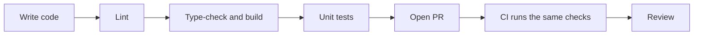

# Code quality

This page explains how we keep the code clean, safe and easy to maintain. Every contributor and maintainer should read it.

## Our quality tools

| Tool | What it checks | Command |
|---|---|---|
| TypeScript (strict) | Types and mistakes before running | `npm run build` |
| ESLint | Bad patterns and import rules | `npm run lint` |
| Prettier | Code formatting | Format on save |
| Vitest | Unit tests for `core` | `npm test` |
| CI (planned) | Runs all of the above on every PR | GitHub Actions |

A PR should not be merged if any of these fail.



## Coding standards

### TypeScript

- Keep `strict` mode on.
- Do not use `any`. If you really need it, use `unknown` and check the type, or add a comment saying why.
- Give public functions clear input and output types.
- Prefer small types and plain objects over big classes.

### Functions and files

- One function should do one job. If you need the word "and" to explain it, split it.
- Keep files under about 300 lines. If a file grows more, split it.
- Use clear names. `mergePdfs` is better than `doStuff`.
- Do not leave dead code, commented-out code or unused files. Git already keeps history.
- Comments should explain **why**, not **what**. The code already shows what.

### The `core` folder (extra strict)

- Functions are pure. Same input gives same output.
- Never change the input array. Return a new one.
- No `window`, `document`, `localStorage`, `fetch`, or imports from Tauri or Capacitor.
- Throw an `Error` with a message that a normal person can understand, like `"This PDF is password protected."`.

### Enforce boundaries with ESLint

Do not depend only on reviewers to remember the rules. Let ESLint fail the build. Example for `eslint.config.js` (proposed):

```js
{
  files: ["src/core/**/*.ts"],
  rules: {
    "no-restricted-imports": ["error", {
      patterns: [
        "react", "react-dom",
        "@tauri-apps/*", "@capacitor/*",
        "**/platform/*", "**/components/*", "**/tools/*", "**/hooks/*",
      ],
    }],
    "no-restricted-globals": ["error", "window", "document", "localStorage", "fetch"],
  },
},
```

You can add a similar rule so that files inside `src/tools/a/` cannot import from `src/tools/b/`. The plugin `eslint-plugin-boundaries` can help.

## Testing

### What to test

All logic in `core` must have tests. Test the normal case and the bad cases.

| Case | Why it matters |
|---|---|
| Normal PDF | The main use |
| One page and many pages | Edge sizes |
| Empty or zero-byte file | Users do select wrong files |
| Corrupt file | Must fail with a clear message, not crash |
| Password protected PDF | Very common in real life |
| Large file | Checks speed and memory |

### Test files

- Keep tiny sample PDFs in `src/core/__fixtures__/`. Each should be a few KB.
- Do not commit real personal documents. Create sample files yourself.
- Tests must run without internet.

### UI testing

For now, test every tool by hand before the PR: a normal file, a big file and a bad file. Add automatic UI tests later when the project is bigger.

## Error handling

- `core` throws clear errors.
- The worker catches them and sends `{ ok: false, error }`.
- The page shows the message in simple words and lets the user try again.
- Never show a blank screen or a raw stack trace to the user.

## Performance

| Rule | Reason |
|---|---|
| Heavy work goes in a Web Worker | Screen stays responsive |
| Send buffers as transferable | No extra copy of big files |
| Lazy load each tool page | Faster first load |
| Lazy load big libraries inside the tool that needs them | Smaller main bundle |
| Release memory: revoke object URLs, drop references to big arrays | Prevents crashes on phones |
| Process page by page when possible | Lower memory use |

Check the bundle size in the `npm run build` output. If the main bundle grows a lot in one PR, ask why.

## Accessibility

- Every input and button has a label.
- The whole tool works with keyboard only.
- Colour contrast is readable in both light and dark theme.
- Do not depend on colour alone to show errors or status.
- Respect `prefers-reduced-motion`.

## Privacy in code

See [Privacy rules](privacy.md). In short: no `fetch`, no analytics, no remote scripts, no storing files.

## Definition of done

A task is done only when all of these are true:

- [ ] Code follows the [architecture rules](architecture.md#the-rules)
- [ ] `npm run lint`, `npm run build` and `npm test` pass
- [ ] New `core` logic has tests
- [ ] Tested by hand on desktop and a small mobile screen
- [ ] No privacy rule is broken
- [ ] Docs are updated if structure or behaviour changed
- [ ] PR is small and has a clear description

## Code smells we reject

- PDF logic inside a React component
- A tool importing another tool
- `if (isTauri)` or `if (isAndroid)` outside `platform/`
- Copy-pasted code between tools
- A new dependency added with no reason
- Huge PRs that change many unrelated things
- Silent failures (`catch {}` with nothing inside)
