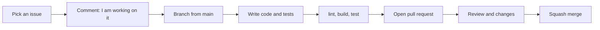

# Contributing

Everyone is welcome here: bug reports, docs, design and code, big or small. If you are new, look for issues labelled `good first issue`.

## Setup

```bash
git clone https://github.com/intabtools/intabpdf.git
cd intabpdf
npm install
npm run dev
```

Before writing code, please read [Architecture](architecture.md) and the [Folder guide](folder-guide.md). They are short and will save you time.

## Workflow



1. Pick an issue, or open one to describe what you want to do. Comment so others know you are working on it.
2. Create a branch from `main`. Do not push directly to `main`.
3. Keep your PR small. **One tool or one fix per PR.**
4. Before opening the PR, run:
   ```bash
   npm run lint
   npm run build
   npm test
   ```
5. Open the PR and explain what you changed and why. Add screenshots for UI changes.
6. Reply to review comments. Do not worry, reviews are normal and everyone gets them.

### Branch names

Use `area/short-description`. Examples: `core/split-pages`, `ui/dark-theme-dropzone`, `docs/privacy-page`.

## Code standards

Short version (full details in [Code quality](code-quality.md)):

- TypeScript strict. Avoid `any`.
- Format with Prettier and ESLint. Turn on format on save, so diffs have no extra whitespace changes.
- New `core` logic needs tests.
- PDF logic stays in `core/`. Never inside React components.
- Make components accessible: labels, keyboard support, good contrast.

## Privacy rules

This is the most important rule of the project. PRs that break it will not be merged. Please read [Privacy rules](privacy.md).

## Adding a library

Check licence, size and network code first. Follow [Dependencies](dependencies.md) and write the reason in your PR.

## Pull request checklist

- [ ] PR is small and focused
- [ ] `npm run lint`, `npm run build` and `npm test` pass
- [ ] Tests added for new `core` logic
- [ ] No privacy rule is broken
- [ ] New dependencies are checked
- [ ] Commit messages follow the [convention](commit-conventions.md)
- [ ] Docs updated if something changed
- [ ] Tested on a small mobile screen

## Need help?

Ask in the issue or the PR. Nobody expects you to know everything. A question is always better than a wrong guess.
