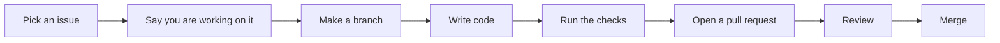

# Contributing

Welcome, and thank you for being here! Everyone can help: bug reports, ideas, docs, design, testing and code. Big or small, all of it matters.

If you are new, look for issues labelled `good first issue`. Do not worry if you are a beginner. We all started somewhere, and questions are always welcome.

## Ways to help

- Write or fix code
- Improve these docs (even a small spelling fix is useful)
- Suggest ideas for tools and screens
- Test the app on your phone or a different browser and tell us what you see
- Report bugs

## Working together

We are a group, so a few small habits make life easy for everyone.

- Comment on the issue when you start, so two people do not do the same work.
- Before a big change (a new folder, a new library, a change in a rule), open an issue or discuss in the group first.
- Every PR is reviewed by at least one other person. Reviewing is also a good way to learn the code.
- Explain your PR in simple words. If a teammate cannot follow it, we simplify it together.
- Pull the latest `main` often, so your branch does not fall far behind.
- Keep it simple. The project is very new, so please build only what is needed now.

## Setup

```bash
git clone https://github.com/intabtools/intabpdf.git
cd intabpdf
npm install
npm run dev
```

Before writing code, please read [Architecture](architecture.md) and the [Folder guide](folder-guide.md). They are short and will save you time.

## How to send your change



1. Pick an issue, or open a new one to tell us your idea. Leave a comment so others know you are working on it.
2. Make a branch from `main`. Please do not push directly to `main`.
3. Keep your PR small. **One tool or one fix per PR.** Small PRs are easier and faster to review.
4. Run these checks before you open the PR:
   ```bash
   npm run lint
   npm run build
   npm test
   ```
   The project is very new, so some of these may not be ready yet. Just run what is available.
5. Open the PR and tell us what you changed and why. For screen changes, a screenshot helps a lot.
6. Reply to review comments. Reviews are normal, and everyone gets them, so please do not feel bad.

### Branch names

Use `area/short-description`. For example: `core/split-pages`, `ui/dark-theme-dropzone`, `docs/privacy-page`.

## Simple code guidelines

These are friendly guidelines, not a test you can fail. More tips are in [Code quality](code-quality.md).

- Use TypeScript and try to avoid `any`.
- Turn on Prettier format on save, so your changes stay clean.
- Keep PDF logic in `core/`, and keep it out of React components.
- Keep each tool inside its own folder in `src/tools/`.
- Keep code simple and add a short comment at the top of new files saying what they do.
- Add a test for new `core` logic if you can.
- Make buttons and inputs easy to use: labels, keyboard support and readable colours.

## Privacy rule

This is the most important rule of the project, so please read [Privacy rules](privacy.md). A PR that breaks it cannot be merged, but we will always explain why and help you fix it.

## Adding a library

Please check the licence, size and network code first. See [Dependencies](dependencies.md) and write the reason in your PR.

## Quick PR checklist

- [ ] The PR is small and focused
- [ ] The available checks pass
- [ ] No privacy rule is broken
- [ ] New libraries (if any) are checked
- [ ] Docs are updated if something changed

## Need help?

Ask in the issue or in the PR. A question is always better than a wrong guess, and nobody will judge you for asking.
