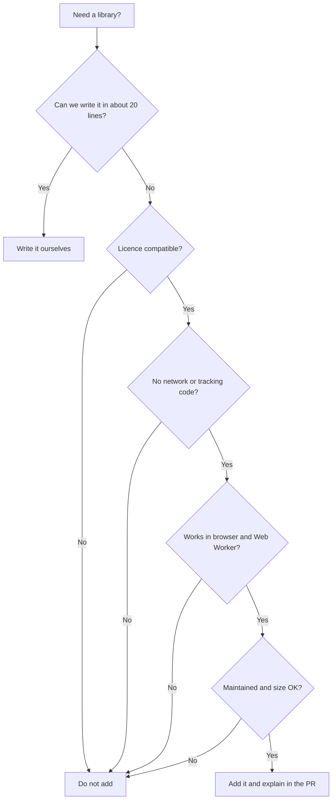

# Dependencies

Every library we add makes the app bigger and gives us more work later. So please add a library only when it really saves effort. This is not to stop anyone. It just keeps the project light.

## Checklist before adding a package

- [ ] **Licence is compatible.** MIT, Apache-2.0, BSD and ISC are usually fine. **Please be careful with GPL and AGPL.** AGPL can force the whole app to be open under AGPL terms, even when shared as a desktop or Android app.
- [ ] **No network or tracking code.** Look at its source and its own dependencies.
- [ ] **Works in the browser and in a Web Worker.** No Node-only APIs.
- [ ] **Still maintained.** Recent releases and a healthy number of users.
- [ ] **Size is okay.** Check the build output. Lazy load big libraries inside the tool that needs them.
- [ ] **`package-lock.json` is committed.**

In the PR description, write the licence and why the package is needed. If you are unsure about any point, ask. We are happy to check together.

## PDF libraries to look at

Please check the current licence and how active the project is before choosing. These things can change.

| Library | Typical use | Note |
|---|---|---|
| `pdf-lib` | Create, merge, split, edit pages | Pure JavaScript, popular for client-side work. Check how actively it is maintained |
| `pdfjs-dist` | Draw pages on canvas, extract text | Mozilla PDF.js. Bundle its worker file locally, so nothing loads from a CDN |
| MuPDF (WASM builds) | Fast rendering and compression | Has been AGPL in the past, so check carefully |

## Updating dependencies

- Use a `deps:` commit.
- Update one big dependency per PR.
- After updating a PDF library, run the tests and try every tool by hand.
- Run `npm audit` now and then. See the [maintainer guide](maintainer-guide.md#monthly-check).
