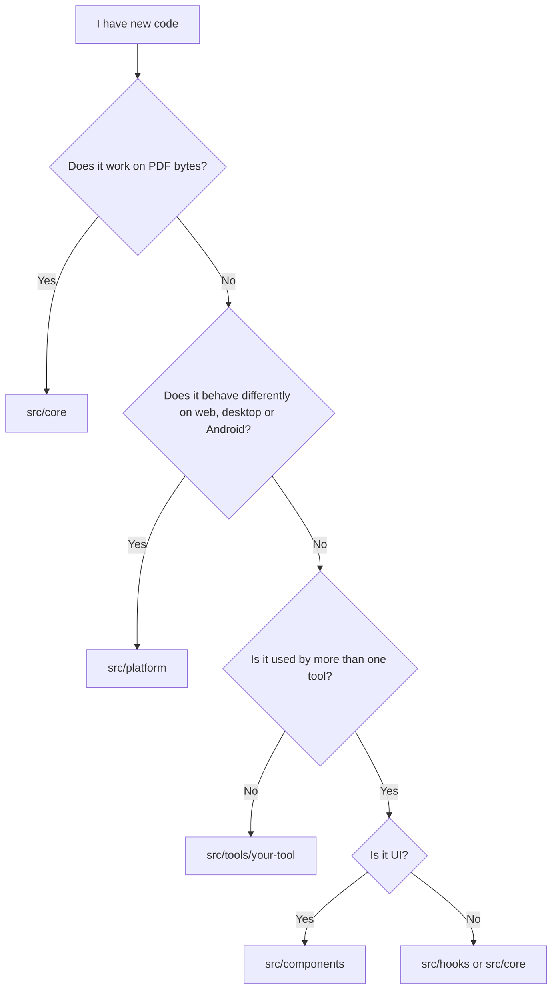

# Folder guide

This page tells you what each folder is for, what should go inside, what should not, and what a reviewer should check.

## Where should my code go?

Use this chart when you are not sure.



## Target layout

```
intabpdf/
├── public/              Static files served as they are
├── src/
│   ├── core/            PDF logic
│   ├── platform/        Per-platform adapter
│   ├── tools/           One folder per tool
│   │   ├── merge/
│   │   ├── split/
│   │   └── registry.ts
│   ├── components/      Shared UI
│   ├── hooks/           Shared React hooks
│   ├── styles/          Global CSS and theme variables
│   ├── App.tsx          Router
│   └── main.tsx         Entry point
├── src-tauri/           Desktop shell (added later)
├── android/             Android shell (added later)
└── docs/                These documents
```

> **Note:** your repo right now has `src/pages/` and `src/workers/` from the starter scaffold. These will move into `src/tools/<name>/` during the "clean the Vite template" task.

## Folder by folder

### `src/core/`

| | |
|---|---|
| **Purpose** | All PDF logic: merge, split, rotate, compress and so on. |
| **Keep here** | Pure functions (bytes in, bytes out), their types, small helpers, unit tests and tiny test PDFs. |
| **Never put here** | React, DOM code (`document`, `window`), Tauri or Capacitor imports, file paths, UI text. |
| **Reviewer checks** | Imports are clean. Function does not change its input. Tests cover empty, corrupt and encrypted PDFs. |

### `src/platform/`

| | |
|---|---|
| **Purpose** | One interface for things that differ per platform: pick files, save files, share. |
| **Keep here** | The interface, one implementation each for web, Tauri and Capacitor, and the runtime detection. |
| **Never put here** | PDF logic, tool-specific code, UI. |
| **Reviewer checks** | Tools call only the interface. No `if (isTauri)` checks outside this folder. |

### `src/tools/<name>/`

| | |
|---|---|
| **Purpose** | Everything for one tool, so tools can be built independently. |
| **Keep here** | `<Name>Page.tsx`, `<name>.worker.ts`, `index.ts` (id, name, icon, route), small tool-only components. |
| **Never put here** | PDF logic (goes to `core`), imports from another tool, platform checks. |
| **Reviewer checks** | Worker is thin. Page uses `ToolLayout`. Tool is added to `registry.ts` with one line. |

### `src/components/`

| | |
|---|---|
| **Purpose** | UI used by two or more tools: drop zone, layout, buttons, progress bar. |
| **Keep here** | Small, reusable, accessible components that get everything through props. |
| **Never put here** | Anything that knows about one specific tool, PDF logic, direct platform calls. |
| **Reviewer checks** | Component has labels and keyboard support. No tool names inside. |

### `src/hooks/`

| | |
|---|---|
| **Purpose** | Shared React hooks, for example `useWorker`, `useFilePicker`. |
| **Keep here** | Hooks that two or more tools use. |
| **Never put here** | PDF logic, tool-specific hooks (keep those inside the tool folder). |

### `src/styles/`

| | |
|---|---|
| **Purpose** | Global CSS and theme variables (colours, spacing, dark mode). |
| **Keep here** | Design tokens and base styles. |
| **Never put here** | Styles meant for only one component. Keep those next to the component. |

### `public/`

| | |
|---|---|
| **Purpose** | Files copied as they are: favicon, app icons, `manifest`. |
| **Reviewer checks** | Files are small. No third-party scripts or remote links. |

### `src-tauri/` and `android/`

| | |
|---|---|
| **Purpose** | Native shells that wrap the web build. |
| **Keep here** | Only config, window setup and file or share plugins. |
| **Never put here** | PDF logic. Keep it in TypeScript. |

### Root files

| File | Purpose |
|---|---|
| `package.json` | Scripts and dependencies. Every new dependency needs a reason in the PR. |
| `vite.config.ts` | Build settings. Keep `base` relative so it works in native shells. |
| `tsconfig*.json` | TypeScript settings. Keep `strict` on. |
| `eslint.config.js` | Lint rules, including import boundaries. |
| `LICENSE` | Project licence. Dependencies must be compatible with it. |

## Naming rules

| Thing | Style | Example |
|---|---|---|
| React component file | PascalCase | `DropZone.tsx` |
| Other TypeScript file | camelCase | `mergePdfs.ts` |
| Tool folder | lowercase, hyphen if needed | `merge`, `split`, `pdf-to-image` |
| Worker file | `<tool>.worker.ts` | `merge.worker.ts` |
| Test file | same name plus `.test.ts` | `merge.test.ts` |
| Types | PascalCase | `ToolDefinition` |
