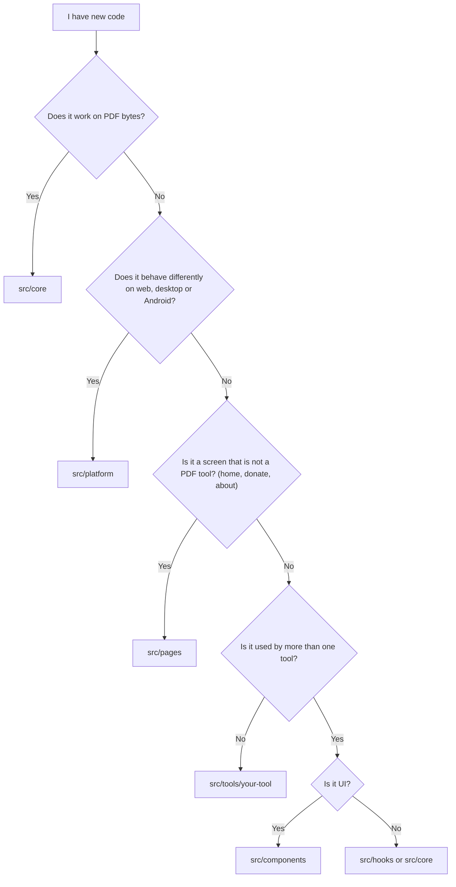

# Folder guide

This page tells you what each folder is for, so you know where to put your code. Some of these folders do not exist yet (they are marked *later* below). We will create them when we need them, so please do not worry if you cannot find one.

## Where should my code go?

Use this chart when you are not sure.



Still confused? Put it inside your own tool folder and ask in your PR. We can move it later.

## Layout

```
intabpdf/
├── public/              Static files served as they are
├── src/
│   ├── core/            PDF logic (bytes in, bytes out)
│   ├── platform/        Per-platform adapter
│   ├── tools/           One folder per tool
│   │   ├── merge/       (example, added with the first tool)
│   │   ├── split/       (example)
│   │   ├── registry.ts  The one list of tools
│   │   └── types.ts     ToolDefinition and worker message types
│   ├── pages/           Screens that are not tools (Home, Donate, About)
│   ├── components/      Shared UI
│   ├── hooks/           Shared React hooks (later)
│   ├── styles/          Global CSS and theme variables (later)
│   ├── assets/          Images and fonts imported by code
│   ├── App.tsx          Router
│   └── main.tsx         Entry point
├── src-tauri/           Desktop app (later)
├── android/             Android app (later)
└── docs/                These documents
```

> **Note:** `core/`, `platform/`, `components/`, `pages/` and `assets/` already exist in the repo. `tools/`, `hooks/` and `styles/` are added with the first tool. The old `src/workers/` folder is **not** part of the plan: each tool keeps its own worker inside its tool folder (see [Architecture](architecture.md#web-workers)).

## Folder by folder

### `src/core/`

- **Purpose:** All PDF logic, like merge, split, rotate and compress.
- **Keep here:** Pure functions (bytes in, bytes out), their types, small helpers, tests and tiny test PDFs.
- **Avoid:** React, `document` or `window`, Tauri or Capacitor imports, file paths, UI text.

### `src/platform/`

- **Purpose:** One interface for things that differ per platform: pick files, save files, share.
- **Keep here:** The interface, one version each for web, Tauri and Capacitor, and the code that detects where the app runs.
- **Avoid:** PDF logic, tool-specific code, UI.

### `src/tools/<name>/`

- **Purpose:** Everything for one tool, so people can build tools without stepping on each other.
- **Keep here:** `<Name>Page.tsx`, `<name>.worker.ts`, `index.ts` (id, name, icon, route) and small components used only by this tool. Outside the tool folders, `tools/` also has `registry.ts` (the list of tools) and `types.ts` (shared tool types).
- **Avoid:** PDF logic (it goes to `core`), imports from another tool, platform checks.

### `src/components/`

- **Purpose:** UI used by two or more tools, like the drop zone, layout, buttons and progress bar.
- **Keep here:** Small, reusable, accessible components that get everything through props.
- **Avoid:** Anything that knows about one specific tool, PDF logic, direct platform calls.

### `src/pages/`

- **Purpose:** Screens that are part of the app but are **not** PDF tools: the home grid, donate, about, privacy page and the "not found" page.
- **Keep here:** One file per screen, like `HomePage.tsx`. A page may use `components/` and read the tool list from `tools/registry.ts`.
- **Avoid:** PDF logic, tool pages (those live in `tools/<name>/`), platform checks.

### `src/hooks/`

- **Purpose:** Shared React hooks, like `useWorker` or `useFilePicker`.
- **Keep here:** Hooks that two or more tools use.
- **Avoid:** PDF logic. Hooks for only one tool stay inside that tool's folder.

### `src/styles/`

- **Purpose:** Global CSS and theme variables (colours, spacing, dark mode).
- **Avoid:** Styles meant for only one component. Keep those next to the component.

### `src/assets/`

- **Purpose:** Images, icons and fonts that your code imports, so Vite can bundle them.
- **Keep here:** Small files only. Fonts must be local files, never links to Google Fonts or a CDN.
- **Avoid:** Files that are not used anywhere. Delete leftover template files like `react.svg`.

### `public/`

- **Purpose:** Files copied as they are: favicon, app icons, `manifest`. Files here are not processed by Vite and are not imported in code.
- **Good to remember:** Keep files small, and no third-party scripts or remote links.

### `src-tauri/` and `android/`

- **Purpose:** The desktop and Android apps that wrap the web build. We will add these later.
- **Keep here:** Only config, window setup and file or share plugins.
- **Avoid:** PDF logic. It stays in TypeScript.

### Root files

| File | Purpose |
|---|---|
| `index.html` | The single page the app loads into. Keep it free of remote scripts and fonts. |
| `package.json` | Scripts and libraries. Please give a reason in your PR for every new library. |
| `package-lock.json` | Exact library versions. Commit it, and do not edit it by hand. |
| `vite.config.ts` | Build settings. Keep `base` relative so it works in the native apps. |
| `tsconfig.json`, `tsconfig.app.json`, `tsconfig.node.json` | TypeScript settings (app code and build tooling). Keep `strict` on. |
| `eslint.config.js` | Lint rules. |
| `LICENSE` | Project licence. Libraries we use must be compatible with it. |
| `README.md` | The front page of the project. |
| `SECURITY.md` | How to report a security or privacy problem privately. |
| `capacitor.config.ts` | Capacitor settings (added with the Android app). |

## Where do types go?

We do not have one big `types/` folder. Keep a type close to the code that uses it. This way you can understand a file without searching the whole project.

| Type | Where it lives |
|---|---|
| Props of a component | In the same component file |
| Options or result of one `core` function | In the same file as the function |
| Types shared by many `core` files | `src/core/types.ts` |
| `PlatformAdapter` | `src/platform/types.ts` |
| `ToolDefinition`, `WorkerRequest`, `WorkerResponse` | `src/tools/types.ts` |
| Types used by one tool only | Inside that tool's folder |

Simple rules:

1. Used by one file? Keep it in that file.
2. Used by many files in one folder? Make a `types.ts` in that folder.
3. Needed by `core` and by other folders? Put it in `core/types.ts`. Other folders can import from `core`, but `core` cannot import from them.

Use `type` for simple shapes and `interface` for things that other code implements, like `PlatformAdapter`.

## Naming

| Thing | Style | Example |
|---|---|---|
| React component file | PascalCase | `DropZone.tsx` |
| Other TypeScript file | camelCase | `mergePdfs.ts` |
| Tool folder | lowercase, hyphen if needed | `merge`, `split`, `pdf-to-image` |
| Page file in `pages/` | PascalCase ending in `Page` | `HomePage.tsx` |
| Other folders | lowercase | `core`, `components` |
| Worker file | `<tool>.worker.ts` | `merge.worker.ts` |
| Test file | same name plus `.test.ts` | `merge.test.ts` |
| Types | PascalCase | `ToolDefinition` |
