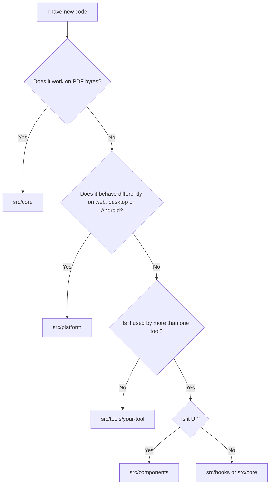

# Folder guide

This page tells you what each folder is for, so you know where to put your code. Some of these folders do not exist yet. We will create them when we need them, so please do not worry if you cannot find one.

## Where should my code go?

Use this chart when you are not sure.



Still confused? Put it inside your own tool folder and ask in your PR. We can move it later.

## Planned layout

```
intabpdf/
├── public/              Static files served as they are
├── src/
│   ├── core/            PDF logic
│   ├── platform/        Per-platform adapter
│   ├── tools/           One folder per tool
│   │   ├── merge/
│   │   ├── split/
│   │   └── registry.ts
│   ├── components/      Shared UI
│   ├── hooks/           Shared React hooks
│   ├── styles/          Global CSS and theme variables
│   ├── App.tsx          Router
│   └── main.tsx         Entry point
├── src-tauri/           Desktop app (added later)
├── android/             Android app (added later)
└── docs/                These documents
```

> **Note:** The repo still has some starter files from the Vite template, like `src/pages/` and `src/workers/`. We will clean them up when the first tool is built.

## Folder by folder

### `src/core/`

- **Purpose:** All PDF logic, like merge, split, rotate and compress.
- **Keep here:** Pure functions (bytes in, bytes out), their types, small helpers, tests and tiny test PDFs.
- **Avoid:** React, `document` or `window`, Tauri or Capacitor imports, file paths, UI text.

### `src/platform/`

- **Purpose:** One interface for things that differ per platform: pick files, save files, share.
- **Keep here:** The interface, one version each for web, Tauri and Capacitor, and the code that detects where the app runs.
- **Avoid:** PDF logic, tool-specific code, UI.

### `src/tools/<name>/`

- **Purpose:** Everything for one tool, so people can build tools without stepping on each other.
- **Keep here:** `<Name>Page.tsx`, `<name>.worker.ts`, `index.ts` (id, name, icon, route) and small components used only by this tool.
- **Avoid:** PDF logic (it goes to `core`), imports from another tool, platform checks.

### `src/components/`

- **Purpose:** UI used by two or more tools, like the drop zone, layout, buttons and progress bar.
- **Keep here:** Small, reusable, accessible components that get everything through props.
- **Avoid:** Anything that knows about one specific tool, PDF logic, direct platform calls.

### `src/hooks/`

- **Purpose:** Shared React hooks, like `useWorker` or `useFilePicker`.
- **Keep here:** Hooks that two or more tools use.
- **Avoid:** PDF logic. Hooks for only one tool stay inside that tool's folder.

### `src/styles/`

- **Purpose:** Global CSS and theme variables (colours, spacing, dark mode).
- **Avoid:** Styles meant for only one component. Keep those next to the component.

### `public/`

- **Purpose:** Files copied as they are: favicon, app icons, `manifest`.
- **Good to remember:** Keep files small, and no third-party scripts or remote links.

### `src-tauri/` and `android/`

- **Purpose:** The desktop and Android apps that wrap the web build. We will add these later.
- **Keep here:** Only config, window setup and file or share plugins.
- **Avoid:** PDF logic. It stays in TypeScript.

### Root files

| File | Purpose |
|---|---|
| `package.json` | Scripts and libraries. Please give a reason in your PR for every new library. |
| `vite.config.ts` | Build settings. Keep `base` relative so it works in the native apps. |
| `tsconfig*.json` | TypeScript settings. Keep `strict` on. |
| `eslint.config.js` | Lint rules. |
| `LICENSE` | Project licence. Libraries we use must be compatible with it. |

## Naming

| Thing | Style | Example |
|---|---|---|
| React component file | PascalCase | `DropZone.tsx` |
| Other TypeScript file | camelCase | `mergePdfs.ts` |
| Tool folder | lowercase, hyphen if needed | `merge`, `split`, `pdf-to-image` |
| Worker file | `<tool>.worker.ts` | `merge.worker.ts` |
| Test file | same name plus `.test.ts` | `merge.test.ts` |
| Types | PascalCase | `ToolDefinition` |
