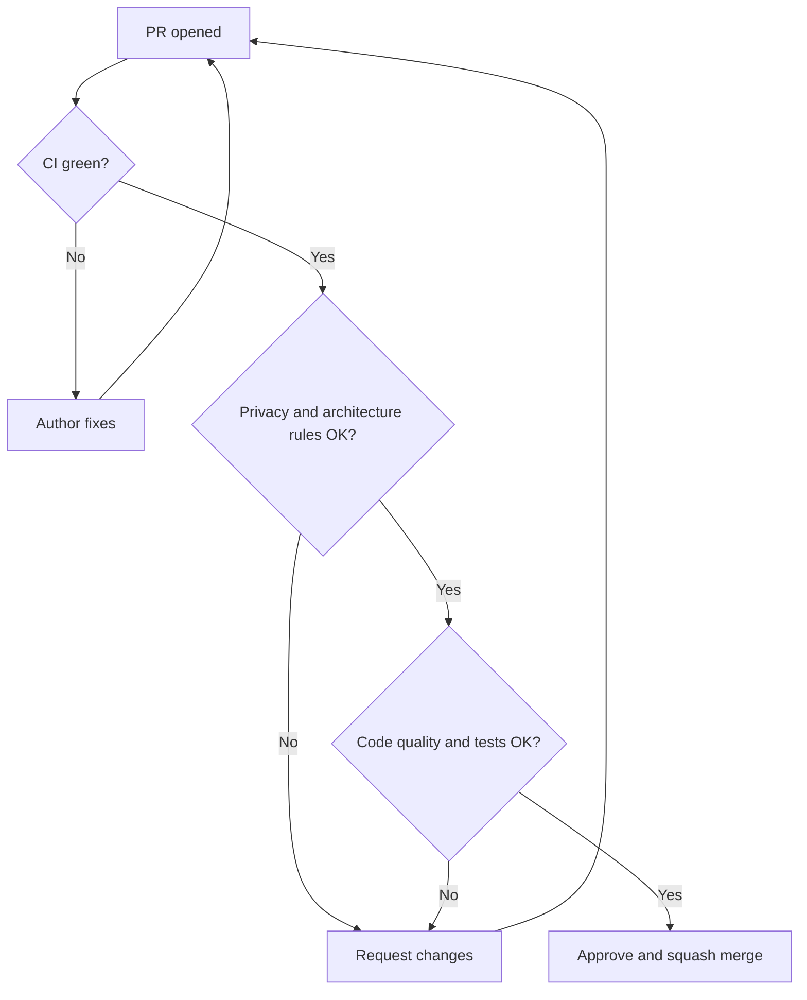
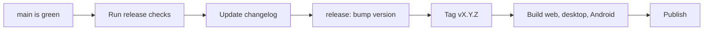

# Maintainer guide

This page is for people who review PRs, manage issues and make releases. If you are a maintainer, your main job is to protect three things:

1. **Privacy.** The user's files never leave their device.
2. **Structure.** The code stays modular so many people can work together.
3. **Quality.** The app stays fast, stable and easy to use.

Also remember we are a student and community project. Be kind, be clear and explain your review comments. A new contributor who feels welcome often becomes a long-term contributor.

## Maintainer routine

| How often | What to do |
|---|---|
| Every day or two | Check new PRs and issues. Reply even if it is only "Thanks, I will review this on Saturday." |
| Every week | Triage new issues (add labels). Look at PRs waiting for more than 7 days. Update the roadmap. |
| Every month | Update dependencies. Run `npm audit`. Check bundle size. Remove dead code. |
| Before every release | Run the [release checklist](#release-checklist) below. |
| Every 3 months | Read the [decisions log](decisions.md) and these docs. Fix anything that is out of date. |

## Reviewing pull requests

### Review in this order

Check the most important things first. If privacy or architecture fails, you do not need to review style.

1. **Privacy.** Search the diff for `fetch(`, `XMLHttpRequest`, `WebSocket`, `sendBeacon`, new `<script>` tags, analytics packages and remote URLs. Any hit needs a clear reason, or the PR is rejected.
2. **Architecture.** Is code in the right folder? Check the [folder guide](folder-guide.md). Does `core` stay clean? Does any tool import another tool? Is there any platform check outside `platform/`?
3. **Correctness.** Does it do what the issue asked? Pull the branch and try it with a normal file, a bad file and a large file.
4. **Tests.** Does new `core` logic have tests, including bad inputs?
5. **Code quality.** Check against [Code quality](code-quality.md): naming, file size, types, errors, no dead code.
6. **User experience.** Mobile screen, keyboard, labels, error messages, progress for slow jobs.
7. **Dependencies.** Any new package? Check licence, size, network code. See [Dependencies](dependencies.md).
8. **Docs and commits.** Are docs updated? Do commits follow the [convention](commit-conventions.md)?

### Writing good review comments

- Say what is wrong and also why. Example: "Please move this to `core`. Then we can test it in Node and reuse it in other tools."
- Separate must-fix from nice-to-have. Start small suggestions with "Nit:".
- Praise good work. A short "Nice, this is clean" helps a lot.
- If something is confusing, ask a question instead of assuming a mistake.

### Merge rules

| Rule | Detail |
|---|---|
| CI must pass | Lint, build and tests |
| Approvals | 1 approval for normal PRs. 2 approvals for changes to `core/`, `platform/`, `registry.ts`, build config, CI or dependencies |
| Merge type | Squash merge. The final commit message follows `area: description` |
| No self-merge | Do not merge your own PR without another review (except tiny typo fixes) |
| No direct push to `main` | Even for maintainers |

### Recommended GitHub settings

- Protect `main`: require PRs, require passing checks, require up-to-date branch.
- Add a `CODEOWNERS` file so the right people are asked to review (for example, `core/` and `platform/` owners).
- Add PR and issue templates.
- Turn on Dependabot or Renovate for updates, and secret scanning.

## Managing issues

### Labels

| Label | Meaning |
|---|---|
| `good first issue` | Small, clear task for new contributors |
| `help wanted` | We need someone to take this |
| `bug` | Something is broken |
| `feature` | New feature or tool |
| `core`, `ui`, `web`, `desktop`, `android`, `build`, `ci`, `docs` | Area (same as commit areas) |
| `privacy` | Anything related to the privacy promise |
| `needs info` | Waiting for more details from the reporter |
| `blocked` | Waiting for another task or decision |
| `wontfix` | We decided not to do this (always explain why) |

### Triage steps

1. Can you reproduce it? If not, ask for steps, browser and device, and add `needs info`.
2. Add area and type labels.
3. Is it small and clear? Add `good first issue` and write a short hint on where to start.
4. Is it a big decision? Discuss it first, then record it in the [decisions log](decisions.md).
5. If there is no reply from the reporter for 14 days after `needs info`, close it politely. They can reopen it.

### Good first issues

Keep at least 5 open good first issues at any time. Each one should say: what to do, which files to look at, and how to test it.

## Handling difficult PRs

| Situation | What to do |
|---|---|
| PR is too big | Ask the author to split it. Offer help on how. |
| PR breaks a privacy rule | Explain the rule, link [Privacy rules](privacy.md), and close if it cannot be fixed. |
| Author has not replied for 14 days | Add a gentle comment. After 30 more days, close with thanks. Another person can continue the work. |
| Idea is good but does not fit the project | Say so kindly and explain why. Suggest a different approach if one exists. |
| Two contributors want the same issue | Give it to the one who commented first. Suggest another issue to the other. |

## Keeping the project maintainable

These habits matter more than any single feature.

1. **Keep PRs small.** One tool or one fix per PR. Small PRs are easier to review and safer to merge.
2. **Protect the boundaries.** Most mess starts when rules 1 to 5 of the [architecture](architecture.md#the-rules) are broken "just once".
3. **Use `core` as the single source of PDF logic.** Never allow two copies of the same logic.
4. **Move shared code up, not sideways.** If two tools need the same code, move it to `core`, `components` or `hooks`.
5. **Delete dead code.** Unused code confuses new people.
6. **Write down decisions.** Add an entry in [decisions.md](decisions.md) for anything people may ask "why?" about later.
7. **Keep docs current.** If a PR changes structure or commands, it must update the docs.
8. **Keep dependencies few.** Each new library is a long-term cost. Ask "can we do this in 20 lines instead?"
9. **Fix flaky tests immediately.** A test that sometimes fails teaches people to ignore CI.
10. **Test on a weak device.** If it works on a low-end Android phone, it works everywhere.
11. **Do not depend on one person.** Share repository access, write things down, and let at least 2 maintainers know each area.

### Monthly health check

- [ ] `npm outdated` and `npm audit` reviewed
- [ ] Dependency licences still compatible
- [ ] Bundle size checked, no big surprise
- [ ] No `fetch(` or third-party scripts in the code (search the repo)
- [ ] CI is green on `main` and not slow
- [ ] Open PRs older than 14 days are handled
- [ ] Roadmap and docs match reality
- [ ] At least 5 `good first issue` items open

## Release checklist

Use [semantic versioning](https://semver.org): `MAJOR.MINOR.PATCH`.

- PATCH: bug fixes only
- MINOR: new tools or features, nothing breaks
- MAJOR: changes that break existing behaviour

Before releasing:

- [ ] CI is green on `main`
- [ ] Every tool tested by hand with a normal, a big and a bad file
- [ ] Network tab check: process a file and confirm **zero** requests are made with user data
- [ ] CSP is still strict (no new allowed origins)
- [ ] `npm audit` has no serious open issues
- [ ] Tested on a low-end Android device (once Android exists)
- [ ] Tested in at least Chrome, Firefox and Safari
- [ ] Changelog written in simple words
- [ ] Version bumped with a `release:` commit and tagged
- [ ] Docs updated

## Security and privacy issues

- If someone reports a problem that could expose user data, ask them to report it privately first. Add a `SECURITY.md` with a contact email when the repo goes public.
- Fix it quickly, release a PATCH, and then explain what happened in simple words.

## When a maintainer leaves

Students get busy with exams, jobs and moving cities. That is normal. Plan for it:

- Tell others in advance when you can.
- Hand over open reviews and release tasks.
- Update `CODEOWNERS` and repository access.
- Write down anything only you know in these docs.

## Red flags

Stop and discuss if you see any of these:

- A PR that adds analytics, "anonymous usage stats" or a remote script
- A dependency with an AGPL or unclear licence
- A change to CSP that allows a new outside domain
- PDF logic being written in Rust or Kotlin
- A giant PR that nobody can review properly
- The same bug fixed in two places because code was copied
