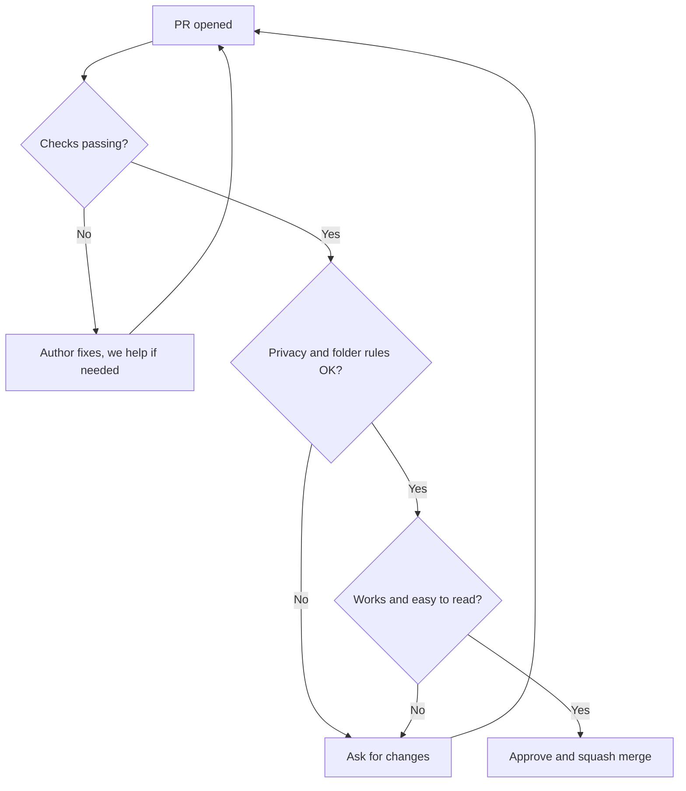
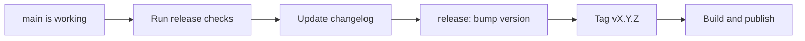

# Maintainer guide

This page is for people who review PRs, manage issues and make releases. Your main job is to protect three things:

1. **Privacy.** The user's files never leave their device.
2. **Simple structure.** The code stays tidy, so many people can work together.
3. **A kind community.** A new contributor who feels welcome often becomes a long-term contributor.

We are a student project, so please be kind to yourself also. Exams and college life come first. It is okay to be slow, as long as you are honest about it.

## Simple routine

| When | What to do |
|---|---|
| Every few days | Look at new PRs and issues. Reply even if it is only "Thanks, I will check this on Saturday." |
| Once a week, if you can | Add labels to new issues. Check PRs that have been waiting for a long time. |
| Once a month, once there is code | Update libraries, run `npm audit`, check bundle size, remove dead code. |
| Before every release | Go through the [release checklist](#release-checklist). |
| Now and then | Read the [decisions log](decisions.md) and these docs. Fix anything that is out of date. |

## Reviewing pull requests

### What to look at, in this order

Look at the most important things first. If privacy or structure has a problem, there is no need to review style yet.

1. **Privacy.** Search the PR for `fetch(`, `XMLHttpRequest`, `WebSocket`, `sendBeacon`, new `<script>` tags, analytics packages and remote URLs. Anything found needs a clear reason, or the PR cannot be merged.
2. **Structure.** Is the code in the right folder? See the [folder guide](folder-guide.md). Does `core` stay clean? Does any tool import another tool? Is there any platform check outside `platform/`?
3. **Does it work?** Does it do what the issue asked? Try the branch with a normal file, a bad file and a large file.
4. **Tests.** Does new `core` logic have tests, including bad inputs?
5. **Readability and user experience.** Clear names, simple code, good error messages, works on a small screen and with the keyboard. See [Code quality](code-quality.md).
6. **New libraries.** Check licence, size and network code. See [Dependencies](dependencies.md).
7. **Docs and commits.** Are the docs updated? Is the commit message in the right format? (You can fix the message while squash merging.)

### Writing good review comments

- Say what is wrong and also why. Example: "Please move this to `core`. Then we can test it in Node and reuse it in other tools."
- Separate must-fix from nice-to-have. Start small suggestions with "Nit:".
- Say thank you and praise good work. A short "Nice, this is clean" helps a lot.
- If something is confusing, ask a question instead of assuming a mistake.

### Merge rules

| Rule | Detail |
|---|---|
| Checks pass | Lint, build and tests (once CI is set up) |
| Approvals | 1 approval is enough. For changes to `core/`, `platform/`, `registry.ts`, build config, CI or libraries, please try to get a second maintainer to look, if one is available |
| Merge type | Squash merge. The final commit message follows `area: description` |
| Your own PR | Please get another person to review it, except for tiny typo fixes |
| `main` branch | Please do not push directly, even if you are a maintainer |

### Good GitHub settings to turn on (when you have time)

- Protect `main`: require PRs and passing checks.
- Turn on **private vulnerability reporting** (Settings, then Security). Our [SECURITY.md](../SECURITY.md) depends on it.
- Add PR and issue templates.
- Later: `CODEOWNERS`, Dependabot or Renovate, and secret scanning.

## Managing issues

### Labels

| Label | Meaning |
|---|---|
| `good first issue` | Small, clear task for new contributors |
| `help wanted` | We need someone to take this |
| `bug` | Something is broken |
| `feature` | New feature or tool |
| `core`, `ui`, `web`, `desktop`, `android`, `build`, `ci`, `docs` | Area (same as commit areas) |
| `privacy` | Anything related to the privacy promise |
| `needs info` | Waiting for more details from the reporter |
| `blocked` | Waiting for another task or decision |
| `wontfix` | We decided not to do this (please always explain why) |

### Triage steps

1. Can you repeat the problem? If not, ask for steps, browser and device, and add `needs info`.
2. Add area and type labels.
3. Is it small and clear? Add `good first issue` and write a short hint on where to start.
4. Is it a big decision? Discuss it first, then write it in the [decisions log](decisions.md).
5. If the reporter does not reply for about 14 days after `needs info`, close the issue politely. They can always reopen it.

### Good first issues

Try to keep a few open all the time (3 or more is great). Each one should say what to do, which files to look at, and how to test it.

## Handling difficult situations

| Situation | What to do |
|---|---|
| PR is too big | Ask the author to split it, and offer help on how |
| PR breaks a privacy rule | Explain the rule, link [Privacy rules](privacy.md), and help fix it. Close it only if it cannot be fixed |
| Author has not replied for a long time (about 2 weeks) | Add a gentle comment. After another month, close with thanks. Someone else can continue |
| Idea is good but does not fit the project | Say so kindly and explain why. Suggest a different approach if there is one |
| Two people want the same issue | Give it to the one who commented first, and suggest another issue to the other |

## Keeping the project healthy

These habits matter more than any single feature.

1. **Keep PRs small.** One tool or one fix per PR.
2. **Protect the folder rules.** Most mess starts when a rule is broken "just once".
3. **Keep PDF logic in `core`.** Avoid two copies of the same logic.
4. **Move shared code up, not sideways.** If two tools need the same code, move it to `core`, `components` or `hooks`.
5. **Delete dead code.** Unused code confuses new people.
6. **Write down decisions** in [decisions.md](decisions.md), for anything people may ask "why?" about later.
7. **Keep docs current.** If a PR changes the structure or commands, update the docs in the same PR.
8. **Keep libraries few.** Ask "can we do this in 20 lines instead?"
9. **Fix flaky tests quickly,** so people do not learn to ignore failing checks.
10. **Try it on a weak device.** If it works on a low-end Android phone, it works everywhere.
11. **Do not depend on one person.** Share repository access and write things down.

### Monthly check

Once there is code, a quick look at these is enough:

- [ ] `npm outdated` and `npm audit`
- [ ] Library licences are still compatible
- [ ] Bundle size has no big surprise
- [ ] No `fetch(` or third-party scripts in the code (search the repo)
- [ ] CI is passing on `main`
- [ ] Old open PRs have been answered
- [ ] Docs match reality
- [ ] Private vulnerability reporting is still turned on and `SECURITY.md` is current

## Release checklist

Use [semantic versioning](https://semver.org): `MAJOR.MINOR.PATCH`.

- PATCH: bug fixes only
- MINOR: new tools or features, nothing breaks
- MAJOR: changes that break existing behaviour

Before releasing:

- [ ] Checks pass on `main`
- [ ] Every tool tried by hand with a normal, a big and a bad file
- [ ] Network tab check: process a file and confirm **zero** requests are made with user data
- [ ] CSP is still strict (no new allowed outside domains)
- [ ] `npm audit` has no serious open issues
- [ ] Tried in Chrome, Firefox and Safari if possible
- [ ] Tried on an Android phone, once the Android app exists
- [ ] Changelog written in simple words
- [ ] Version bumped with a `release:` commit and tagged
- [ ] Docs updated

## Security and privacy reports

This repo is public, so people should not post security problems as normal issues. See [SECURITY.md](../SECURITY.md).

- If someone posts a problem that could expose user data in a public issue, thank them, ask them to report it privately, and hide or edit the public issue if you can.
- Reply to private reports as soon as you can.
- Fix it quickly, release a PATCH, and then explain what happened in simple words.

## When a maintainer needs to leave

Students get busy with exams, jobs and moving to new cities. That is completely normal. To make it smooth:

- Tell others in advance if you can.
- Hand over your open reviews and release tasks.
- Update repository access (and `CODEOWNERS`, once we have it).
- Write down anything only you know in these docs.

## Red flags

Please stop and discuss with the team if you see any of these:

- A PR that adds analytics, "anonymous usage stats" or a remote script
- A library with an AGPL or unclear licence
- A change to the CSP that allows a new outside domain
- PDF logic being written in Rust or Kotlin
- A giant PR that nobody can review properly
- The same bug fixed in two places because code was copied
