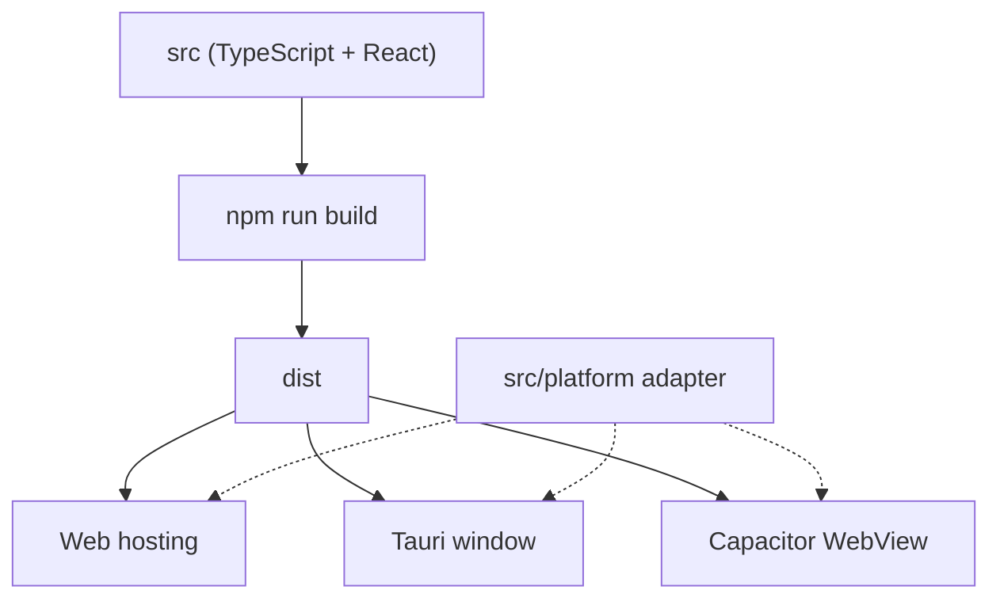

# Platforms

One codebase, three targets. Tauri and Capacitor both load the **same web build** (the `dist` folder).

| Platform | Shell | Folder | Status |
|---|---|---|---|
| Web | Vite static build | root | In development |
| Desktop | Tauri | `src-tauri/` | Planned |
| Android | Capacitor | `android/` | Planned |



## Web

```bash
npm run dev      # dev server
npm run build    # production build in dist/
npm run preview  # serve the build locally
```

The build is plain static files. You can host it anywhere, for example GitHub Pages, Netlify or Cloudflare Pages. Use `HashRouter` and a relative `base` in `vite.config.ts` so paths work in sub-folders and inside native shells.

Later we may add a PWA with a service worker, so the web version also works offline. The service worker must only cache app files. It must never send user data anywhere.

## Desktop (Tauri)

- Tauri puts `dist/` inside a native window. App code stays the same.
- Keep Rust code very small: window setup, file dialogs and saving. **No PDF logic in Rust.**
- Set a strict CSP in `tauri.conf.json`. Enable only the Tauri plugins we really need.
- Use `desktop:` in commit messages.

## Android (Capacitor)

- Capacitor puts `dist/` inside a WebView.
- File picking and sharing use Capacitor plugins, called only from `platform/`.
- Test on a low-end phone. Big PDFs can use up the WebView memory, so workers and transferable buffers are important.
- Use `android:` in commit messages.

## Simple rule

If code behaves differently on web, desktop and Android, it belongs in `src/platform/`. Everything else must work the same on all three.
