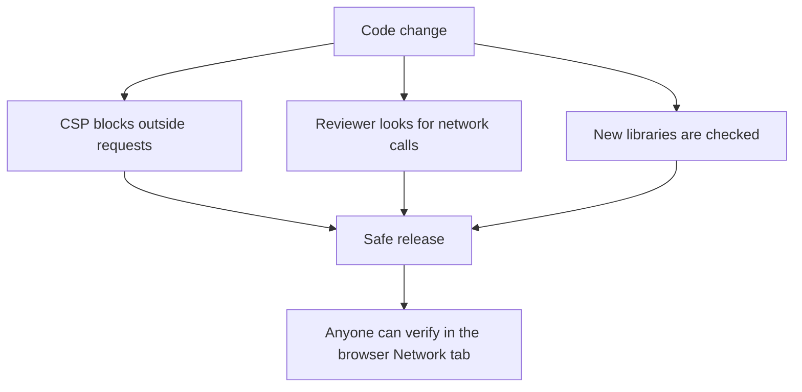

# Privacy rules

The privacy promise is the heart of this project. Everything else can change, but this stays. A PR that breaks it cannot be merged. We will always explain why and help you find another way.

## The rules

- No network request may send user files, or anything taken from user files.
- No analytics, telemetry, tracking or ads. No third-party scripts that do any of these.
- No accounts or sign-in.
- No remote fonts, CDNs or scripts at runtime. Bundle everything inside the app.
- Do not keep user files after the session, unless the user saves them on purpose. Prefer working in memory.

## How we keep the promise

Rules written in a document are good, but we also use simple technical checks.

1. **A strict Content-Security-Policy** in `index.html` and later in `tauri.conf.json`. For example: `default-src 'self'; connect-src 'none'; img-src 'self' data: blob:; worker-src 'self' blob:`. We will adjust it when the first tool is ready.
2. **Reviewer check.** Reviewers search the PR for `fetch(`, `XMLHttpRequest`, `WebSocket`, `sendBeacon` and new `<script>` tags.
3. **Library check.** New packages are checked for tracking or network code, not only for the licence.
4. **Anyone can verify.** Open the browser Network tab, process a file, and see that no request is made.

## What is allowed and what is not

| Allowed | Not allowed |
|---|---|
| Loading the app files from the same site | Sending a file, its name or its text to any server |
| Fonts and images bundled in the app | Google Fonts or any CDN link |
| Saving the user's theme choice in `localStorage` | Saving file contents or file names in storage |
| Error messages shown on screen | Sending error reports to a server |

If you are not sure about something, just ask in an issue before writing the code. We are happy to help.

## Reporting a privacy problem

For a general question or concern, open an issue with the `privacy` label.

If the problem could expose user data, please do not post it publicly, because this repo is public. Report it privately instead. See [SECURITY.md](../SECURITY.md) for how.
