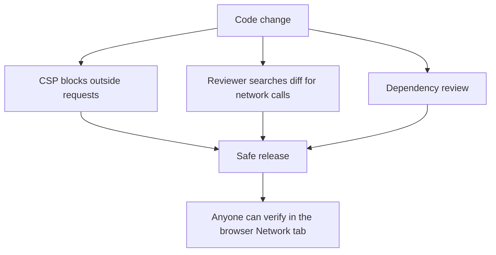

# Privacy rules

The privacy promise is the heart of this project. **Pull requests that break it will not be merged.**

## Rules

- No network request may send user files or anything taken from user files.
- No analytics, telemetry, tracking or ads. No third-party scripts that do any of these.
- No accounts or sign-in.
- No remote fonts, CDNs or scripts at runtime. Bundle everything inside the app.
- Do not store user files after the session unless the user saves them on purpose. Prefer processing in memory.
- Check the licence of every new dependency. See [Dependencies](dependencies.md).

## How we enforce it

Rules written in a document are not enough. We also add technical checks.

1. **Strict Content-Security-Policy** in `index.html` and `tauri.conf.json`. Example: `default-src 'self'; connect-src 'none'; img-src 'self' data: blob:; worker-src 'self' blob:`. Adjust it when the first tool is ready.
2. **Reviewer check.** Search every PR for `fetch(`, `XMLHttpRequest`, `WebSocket`, `sendBeacon` and new `<script>` tags.
3. **Dependency review.** Check new packages for tracking or network code, not only the licence.
4. **Users can verify.** Anyone can open the browser Network tab, process a file and see that no request is made.

## What is allowed and what is not

| Allowed | Not allowed |
|---|---|
| Loading the app files from the same site | Sending a file, its name or its text to any server |
| Fonts and images bundled in the app | Google Fonts or any CDN link |
| Saving the user's theme choice in `localStorage` | Saving file contents or file names in storage |
| Error messages shown on screen | Sending error reports to a server |

If you are not sure, ask in the issue before writing code.

## Reporting a privacy issue

Open an issue with the `privacy` label. If the problem could expose user data, please report it privately to the maintainers first. Add a `SECURITY.md` with a contact email when the repo becomes public.
